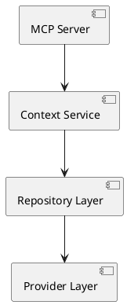

# ADR 005: Automated Documentation System

Date: 2026-01-07

## Status

Accepted

## Context

The MCP Context Browser is a complex enterprise system with multiple components, APIs, and business logic. Manual documentation maintenance is error-prone, time-consuming, and often becomes outdated.

Key requirements:

1.**Accuracy**: Documentation must stay synchronized with code
2.**Completeness**: All public APIs and business logic documented
3.**Accessibility**: Multiple documentation formats for different audiences
4.**Automation**: Documentation generation integrated into CI/CD
5.**Quality**: Professional documentation standards

## Decision

Implement an automated documentation system using existing scripts and tools:

1.**mdBook**: Interactive documentation platform
2.**Cargo modules**: Automated dependency graph generation
3.**ADR System**: Professional decision documentation
4.**API Documentation**: Auto-generated from code comments
5.**CI/CD Integration**: Automated documentation validation and deployment

## Consequences

### Positive

\1-  **Consistency**: Documentation automatically stays current
\1-  **Accuracy**: No drift between code and documentation
\1-  **Efficiency**: Reduced manual documentation effort
\1-  **Quality**: Consistent formatting and structure
\1-  **Accessibility**: Multiple formats and delivery methods

### Negative

\1-  **Tool Complexity**: Multiple documentation tools to maintain
\1-  **CI/CD Overhead**: Documentation generation adds build time
\1-  **Learning Curve**: Understanding documentation tooling

### Risks

\1-  **Tool Failures**: Documentation generation could break builds
\1-  **Over-Automation**: Important context lost in automation
\1-  **Maintenance Burden**: Keeping documentation tools updated

## Implementation

### Documentation Architecture

```
docs/
├── architecture/          # System architecture docs
│   ├── adr/              # Architecture Decision Records
│   ├── diagrams/         # Auto-generated diagrams
│   └── ARCHITECTURE.md   # System overview
├── user-guide/           # User documentation
├── developer/            # Developer guides
├── operations/           # Deployment and operations
├── api/                  # API documentation
└── book.toml            # mdBook configuration
```

### Automation Scripts

#### ADR Management

```bash

# Create new ADR
scripts/docs/create-adr.sh batch "Decision Title"

# Validate ADRs
scripts/docs/validate.sh adrs
```

#### Documentation Generation

```bash

# Generate module documentation
scripts/docs/generate-module-docs.sh

# Sync to mdBook
scripts/docs/mdbook-sync.sh
```

#### Quality Assurance

```bash

# Validate all documentation (ADRs, structure, links)
scripts/docs/validate.sh all

# Validate specific aspects
scripts/docs/validate.sh adrs      # ADR format and numbering
scripts/docs/validate.sh structure # Directory structure
scripts/docs/validate.sh links     # Internal/external links
scripts/docs/validate.sh markdown  # Markdown linting

# Fix markdown issues
scripts/docs/markdown.sh fix
```

### CI/CD Integration

#### Documentation Pipeline

```yaml
documentation:
\1-   scripts/docs/validate.sh all
\1-   scripts/docs/generate-diagrams.sh
```

#### Quality Gates

\1-   ✅ ADR validation passes
\1-   ✅ Link validation passes
\1-   ✅ Markdown linting passes
\1-   ✅ Documentation builds successfully

### Content Automation

#### API Documentation

```rust
/// Business logic description
///
/// # Business Value
/// - Point 1
/// - Point 2
///
/// # Examples
/// ```
/// // Example usage
/// ```
pub struct Component {
    // Implementation
}
```

#### Architecture Diagrams



## Documentation Standards

### Code Documentation

\1-  **Modules**: Business purpose and architecture role
\1-  **Structs**: Business entities and responsibilities
\1-  **Functions**: Business logic and side effects
\1-  **Error Types**: When errors occur and recovery guidance

### ADR Standards

\1-  **Context**: Business problem being solved
\1-  **Decision**: Technical approach chosen
\1-  **Consequences**: Business impact assessment
\1-  **Implementation**: Code examples and integration points

### User Documentation

\1-  **Getting Started**: Quick setup for business users
\1-  **API Reference**: Complete endpoint documentation
\1-  **Troubleshooting**: Common issues and solutions
\1-  **Best Practices**: Enterprise usage patterns

## Tool Selection

### mdBook

\1-  **Pros**: Interactive, searchable, professional appearance
\1-  **Use**: User guides, developer documentation, API references

### Cargo modules

\1-  **Pros**: Automatic dependency visualization
\1-  **Use**: Architecture diagrams, module relationship documentation

### ADR Tools

\1-  **Pros**: Structured decision documentation
\1-  **Use**: Architecture decisions, technical rationale

### Custom Scripts

\1-  **Pros**: Tailored to project needs
\1-  **Use**: Validation, automation, quality assurance

## Quality Assurance

### Automated Checks

\1-  **Markdown Linting**: Consistent formatting
\1-  **Link Validation**: All references working
\1-  **ADR Compliance**: Required fields present
\1-  **Documentation Coverage**: Minimum documentation standards

### Manual Reviews

\1-  **Content Quality**: Business accuracy and clarity
\1-  **Technical Accuracy**: Code examples working
\1-  **Completeness**: All features documented

## References

\1-   [mdBook Documentation](https://rust-lang.github.io/mdBook/)
\1-   [Cargo modules](https://github.com/regexident/cargo-modules)
\1-   [ADR Guidelines](https://adr.github.io/)
\1-   [Documentation Best Practices](https://documentation.divio.com/)
