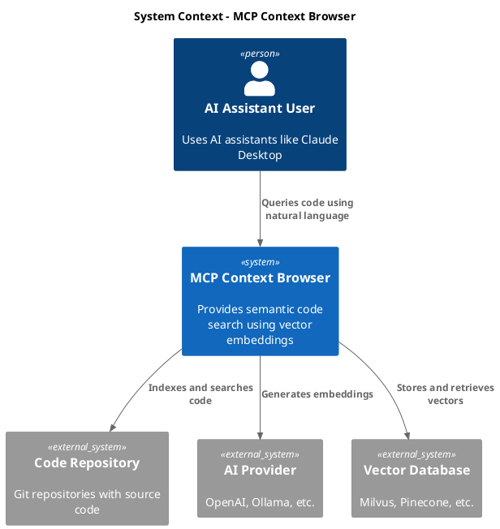

# ADR 003: C4 Model Documentation

## Status

Accepted

## Context

The MCP Context Browser is a complex system with multiple architectural layers, external integrations, and evolving requirements. The project needs comprehensive, scalable documentation that can be understood by different audiences (developers, architects, operations teams) at various levels of detail.

Current documentation challenges:

\1-   Architecture documentation was inconsistent and incomplete
\1-   Different audiences needed different levels of detail
\1-   Visual diagrams were missing or outdated
\1-   No standardized approach to documenting architectural decisions
\1-   Difficulty communicating system complexity to stakeholders

The team needed a structured approach to architecture documentation that would scale with the project and provide clear communication channels.

## Decision

Adopt the C4 model for architecture documentation, using PlantUML for diagram generation and Markdown for structured documentation. The C4 model provides four levels of architectural detail with clear scope and audience definitions.

Implementation approach:

\1-  **Context Diagrams**: System-level overview for non-technical stakeholders
\1-  **Container Diagrams**: High-level technical overview for technical stakeholders
\1-  **Component Diagrams**: Detailed design for developers
\1-  **Code Diagrams**: Implementation-level detail for maintainers
\1-   PlantUML for consistent, version-controlled diagram generation
\1-   Structured Markdown documentation with clear navigation
\1-   Automated diagram validation and generation

## Consequences

C4 model provides excellent structure and scalability but requires discipline in maintaining multiple levels of documentation.

### Positive Consequences

\1-  **Clear Structure**: Four well-defined levels of architectural detail
\1-  **Audience-Specific**: Different views for different stakeholders
\1-  **Consistency**: Standardized notation and format
\1-  **Maintainability**: Modular documentation that can evolve
\1-  **Tooling Support**: Rich ecosystem of tools and integrations
\1-  **Communication**: Better understanding across technical and non-technical teams

### Negative Consequences

\1-  **Documentation Overhead**: Multiple diagrams and documents to maintain
\1-  **Learning Curve**: Team needs to learn C4 notation and concepts
\1-  **Maintenance Burden**: Diagrams can become outdated if not maintained
\1-  **Tool Complexity**: PlantUML syntax has learning curve
\1-  **Scope Management**: Need to decide what belongs at each level

## Alternatives Considered

### Alternative 1: Free-Form Documentation

\1-  **Description**: Custom documentation structure without formal methodology
\1-  **Pros**: Flexible, no learning curve, quick to start
\1-  **Cons**: Inconsistent, hard to navigate, doesn't scale
\1-  **Rejection Reason**: Leads to poor documentation quality and maintenance issues

### Alternative 2: UML Only

\1-  **Description**: Traditional UML diagrams for all architectural views
\1-  **Pros**: Formal notation, detailed modeling capabilities
\1-  **Cons**: Too technical for non-technical audiences, complex to maintain
\1-  **Rejection Reason**: Overkill for our needs and doesn't serve diverse audiences well

### Alternative 3: Arc42 Template

\1-  **Description**: Comprehensive architecture documentation template
\1-  **Pros**: Very thorough, covers all aspects, proven methodology
\1-  **Cons**: Too heavyweight, would take too long to implement fully
\1-  **Rejection Reason**: Overkill for current team size and project stage

### Alternative 4: 4+1 Architectural View Model

\1-  **Description**: Rational Unified Process architectural views
\1-  **Pros**: Formal methodology, comprehensive coverage
\1-  **Cons**: Complex to understand and maintain, academic focus
\1-  **Rejection Reason**: Too complex for practical use in agile development

## Implementation Notes

### C4 Level Structure

#### Level 1: System Context

```
Purpose: Show how the system fits into the world
Audience: Everyone (technical and non-technical)
Content: System boundaries, users, external systems
Notation: Simple boxes and arrows
```

#### Level 2: Container Architecture

```
Purpose: Show high-level technology choices
Audience: Technical stakeholders
Content: Containers, technologies, communication patterns
Notation: Containers with technology labels
```

#### Level 3: Component Architecture

```
Purpose: Show component design and responsibilities
Audience: Developers and architects
Content: Components, interfaces, data flows
Notation: Detailed component relationships
```

#### Level 4: Code Architecture

```
Purpose: Show implementation details
Audience: Developers maintaining code
Content: Classes, interfaces, implementation patterns
Notation: UML class diagrams, sequence diagrams
```

### PlantUML Integration

#### Diagram Generation Pipeline

```makefile

# Makefile integration
.PHONY: docs diagrams clean-docs

diagrams: $(wildcard docs/diagrams/*.puml)
 @for file in $^; do \
  plantuml -tpng $$file; \
  plantuml -tsvg $$file; \
 done

docs: diagrams
 @echo "Generating documentation..."
 @cargo run --bin doc-generator

clean-docs:
 @rm -f docs/diagrams/*.png docs/diagrams/*.svg
```

#### Diagram Template Structure



### Documentation Automation

#### CI/CD Integration

```yaml

# .github/workflows/docs.yml
name: Documentation
on:
  push:
    branches: [ main ]
    paths:
\1-   'docs/**'
\1-   'src/**'
\1-   'ARCHITECTURE.md'

jobs:
  validate-diagrams:
    runs-on: ubuntu-latest
    steps:
\1-   uses: actions/checkout@v3
\1-   name: Validate PlantUML
        uses: cloudbees/plantuml-github-action@master
        with:
          args: -v -checkmetadata docs/diagrams/*.puml

  build-docs:
    runs-on: ubuntu-latest
    steps:
\1-   uses: actions/checkout@v3
\1-   name: Setup Rust
        uses: actions-rust-lang/setup-rust-toolchain@v1
\1-   name: Generate Diagrams
        run: make diagrams
\1-   name: Build Documentation
        run: make docs
\1-   name: Deploy to GitHub Pages
        uses: peaceiris/actions-gh-pages@v3
        with:
          github_token: ${{ secrets.GITHUB_TOKEN }}
          publish_dir: ./docs/build
```

#### Documentation Validation

```rust
pub struct DocumentationValidator {
    plantuml_path: PathBuf,
    markdown_files: Vec<PathBuf>,
}

impl DocumentationValidator {
    pub async fn validate_all(&self) -> Result<ValidationReport> {
        let mut report = ValidationReport::new();

        // Validate PlantUML syntax
        for diagram in &self.plantuml_files() {
            if !self.validate_plantuml(diagram).await? {
                report.add_error(format!("Invalid PlantUML: {}", diagram.display()));
            }
        }

        // Validate Markdown links
        for doc in &self.markdown_files {
            if !self.validate_markdown_links(doc).await? {
                report.add_warning(format!("Broken links in: {}", doc.display()));
            }
        }

        // Validate diagram consistency
        if !self.validate_diagram_consistency().await? {
            report.add_warning("Diagrams may be inconsistent with code".to_string());
        }

        Ok(report)
    }
}
```

### Documentation Maintenance

#### Change Tracking

```rust
#[derive(Serialize, Deserialize)]
pub struct ArchitectureChange {
    pub timestamp: DateTime<Utc>,
    pub component: String,
    pub change_type: ChangeType,
    pub description: String,
    pub affected_diagrams: Vec<String>,
    pub requires_review: bool,
}

pub struct DocumentationTracker {
    changes: Vec<ArchitectureChange>,
}

impl DocumentationTracker {
    pub async fn record_change(&mut self, change: ArchitectureChange) -> Result<()> {
        self.changes.push(change);

        // Update affected diagrams
        for diagram in &change.affected_diagrams {
            self.update_diagram_timestamp(diagram).await?;
        }

        // Trigger review if needed
        if change.requires_review {
            self.notify_reviewers(&change).await?;
        }

        Ok(())
    }
}
```

## References

\1-   [C4 Model Website](https://c4model.com/)
\1-   [PlantUML Documentation](https://plantuml.com/)
\1-   [Structurizr - C4 Tooling](https://structurizr.com/)
\1-   [The C4 model for visualising software architecture](https://www.infoq.com/articles/C4-architecture-model/)
